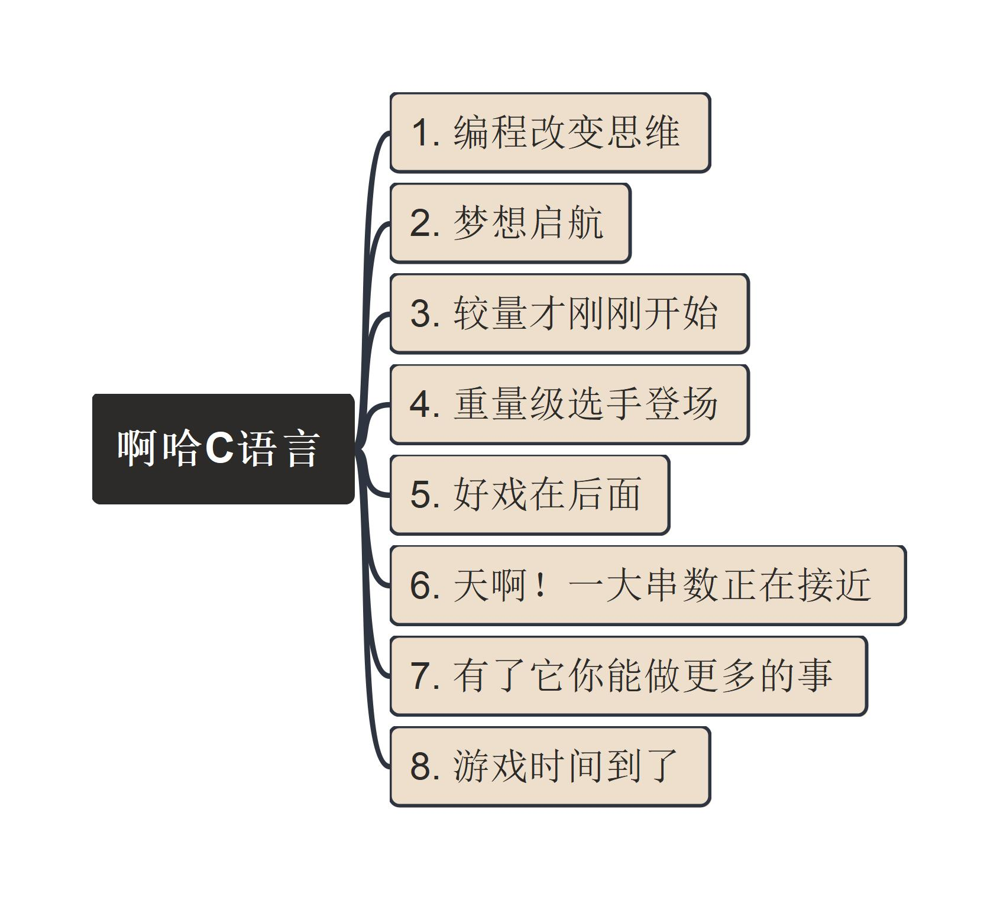

# aha-C 《啊哈C语言》

Learning by Practicing on "啊哈C语言"

---

## 思维导图：[文件](aha.mm)

---

## 章节目录

1. [编程改变思维](/1_编程改变思维)
2. [梦想启航](./2_梦想启航)
3. [较量才刚刚开始](./3_较量才刚刚开始/)
4. [重量级选手登场](./4_重量级选手登场/)
5. [好戏在后面](./5_好戏在后面/)
6. [天啊！一大串数正在接近](./6_一大串数正在接近/)
7. [有了它你能做更多的事](./7_有了它你能做更多的事/)
8. [游戏时间到了](./8_游戏时间到了/)

---

## 视频链接

- [YouTube Video List](https://www.youtube.com/playlist?list=PL6DEHvciXKeVzQIMSwYjtMO3v8HmU9OOZ)
- [BiliBili B站 第一集](https://www.bilibili.com/video/BV1HQ4y177Fz/)

欢迎发送邮件（[电子邮箱](mailto:xiaoqizhao@outlook.com)）提问与讨论。